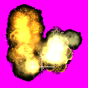

# ppdrow

* [버블슈터](https://namu.wiki/w/%EB%B2%84%EB%B8%94%EC%8A%88%ED%84%B0) 스프라이트 리소스를 비트맵 파일로 추출하는 프로그램

## Usage

1. 버블슈터 클라이언트 다운로드 및 설치
* https://cafe.naver.com/shooter77/4330
* https://cafe.naver.com/shooter77/4331

2. cmd.exe를 **관리자 권한**으로 실행

3. `cd C:\Program Files (x86)\KidnKid\BubbleShooter` 입력

4. `dir /s /b *.jsf > list.txt` 입력

5. `ppdrow.exe`를 게임 폴더로 이동

6. `ppdrow.exe`와 `list.txt`가 게임 폴더에 들어있는지 확인
    
    

7. cmd 창에서 `ppdrow.exe < list.txt` 입력

    

8. 추출 시작. 약 2GB 정도 여유공간 필요

    

    

## Sprite Samples

